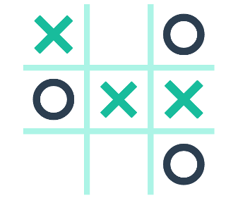
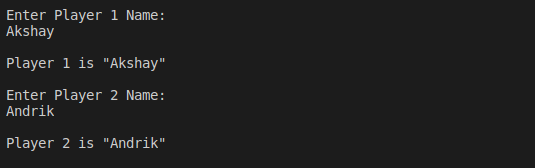
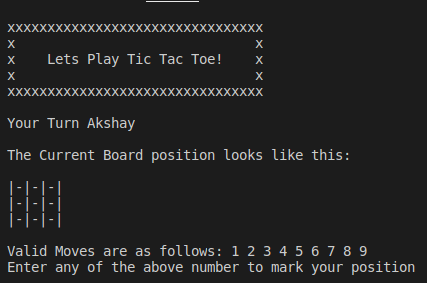
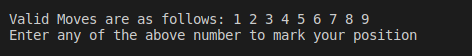
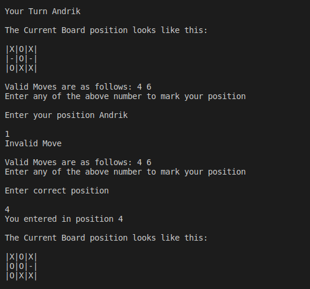
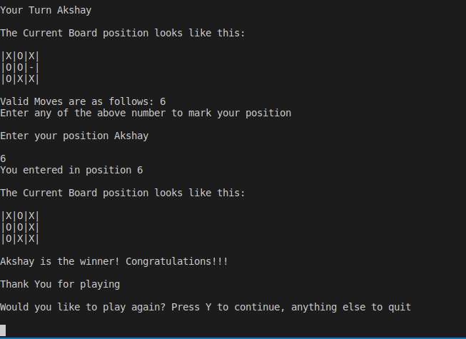
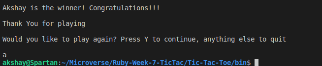

## Tic Tac Toe Game in Ruby

Creating the "Tic Tac Toe" Game using OOP (Object Oriented Methodology).

This Microverse project consists of recreating the famous game "Tic Tac Toe" using the language Ruby to test our knowledge and abilities to manage classes, methods, and different objects

## Built With

- Ruby
- VsCode.

## Getting Started

**Prerequisites:**

- Text Editor (VSCode is suggested)
- Ruby.

## Setup

To play the game locally follow these simple steps:

1. Download or clone this repository
2. Navigate to project Directory on your terminal (cd Directory)
3. Allow bin/main.rb to be executable by running this command: chmod 755 bin/main.rb
4. Now, just run bin/main.rb in your terminal and have fun!

## What is Tic Tac Toe?

1. Tic Tae is a 2 player game where the goal is to mark your signs/symbols X or 0 in consecutively.
2. It is usually played on a 3x3 board but can be played on bigger boards. So a 3x3 board the goal is to complete 3 signs consecutively.
3. It can either be horizontally, vertically or diagonally.
4. Every player plays alternatively. If no consecutive pattern is made, it is a draw!

## Tic Tac Toe Game Rules

- Every player makes alternate moves.
- Valid moves are only in blank squares where no move has been already made.
- If pattern of same symbols is formed, horizontally, vertically or diagonally the player doing so wins.
- If no consecutive pattern is formed, it is a draw!
- Check Game Instructions section for detailed instructions on how to play the game with images.

## Game Instructions

##### 1. After running the code, introduce player one name and press enter

##### 2. Then you need to repeat the process with player two

**3. The game will display the board**

**4. Player one choose a position (which is not occupied) in the board from 1 to 9**

**5. Now the same with player two and repeat the sequence until there is a winner or the board is full which would result in a draw**

**6. Press "Y" if you want to play another round!**

## Live Demo

## Authors:

👤 **Akshay Narkar**

- Github: [@akshay-narkar](https://github.com/akshay-narkar)
- Twitter: [@akidoit](https://twitter.com/akidoit)

👤 **Andrik Solis**

- GitHub: [Andrik27001](https://github.com/Andrik27001)
- Twitter: [@Andrik22693566](https://twitter.com/Andrik22693566)
- LinkedIn: [LinkedIn](https://www.linkedin.com/in/andrik-solis-paniagua-a0ab251b5/)

## 🤝 Contributing

Contributions, issues and feature requests are welcome! Start by:

- Forking the project
- Cloning the project to your local machine
- `cd` into the project directory
- Run `git checkout -b your-branch-name`
- Make your contributions
- Push your branch up to your forked repository
- Open a Pull Request with a detailed description to the development branch of the original project for a review

## Show your support

Give a :star: if you like this project!

## 📝 License

This project is [MIT](https://opensource.org/licenses/MIT) licensed.
